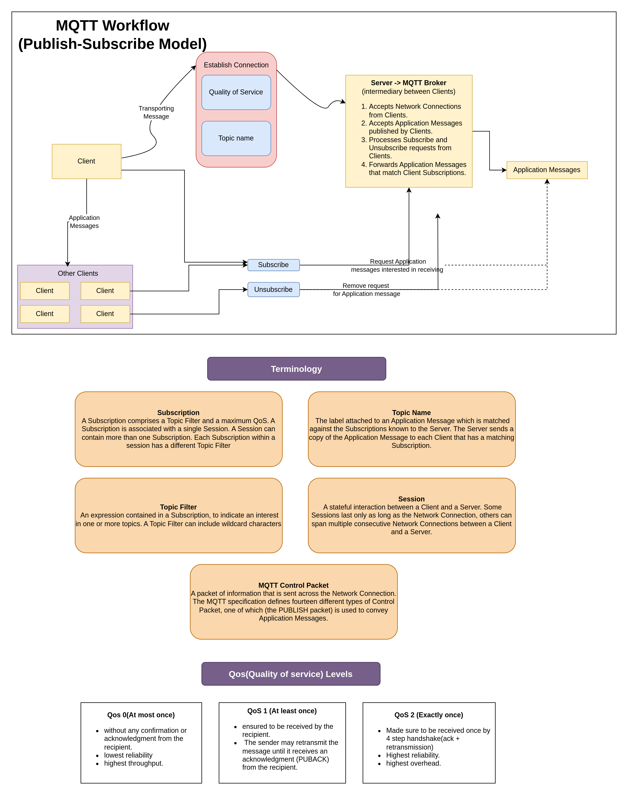

# Go MQTT: Understanding MQTT with Go

This repository is aimed at understanding MQTT (Message Queuing Telemetry Transport) using the Go programming language. MQTT is a lightweight messaging protocol commonly used in IoT (Internet of Things) and other resource-constrained environments for communication between devices.

## Overview

The repository provides examples and implementations of various MQTT functionalities using Go, covering topics such as:

- Connecting to an MQTT broker
- Publishing messages to topics
- Subscribing to topics and receiving messages
- Quality of Service (QoS) levels
- Retained messages
- Last Will and Testament (LWT)
- TLS (Transport Layer Security) encryption for secure communication

## Installation

To use the examples in this repository, you need to have Go installed on your system. You can download and install Go from the [official website](https://golang.org/).

Clone the repository to your local machine
- using ssh:

```bash
    git clone git@github.com:vacaramin/Go-MQTT.git
```

- using https:

```bash
    git clone https://github.com/vacaramin/Go-MQTT.git
```
## Usage
Install necessary dependencies:
```bash
    go mod tidy
```

Run the example files to see MQTT functionalities in action:
```bash
    go run examples/publish.go
    go run examples/subscribe.go
```
Make sure to configure the MQTT broker details (e.g., broker address, port, credentials) in the example files before running them.
